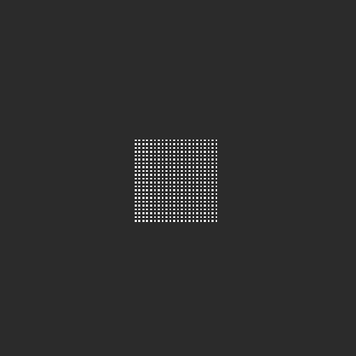

# minimal mlsrk implementation

unity implementation of 'A Moving Least Square Reproducing Kernel Particle Method for Unified Multiphase Continuum Simulation' by Chen et al.

it's based largely on their [open source minimal C implementation on acm](https://dl.acm.org/doi/abs/10.1145/3414685.3417809) (see 'supplemental material' zip file)

i decided to tidy this up and release after chats with a few ppl on the [Ten Minute Physics](https://matthias-research.github.io/pages/tenMinutePhysics/index.html) discord server. good place to find people working on this sort of simulation research

## running it

unity version is 2021.3.5f1, it's using burst a bit for parallelisation but u could delete all that and run this in an older unity version, it doesn't really depend on anything version-specific.

if you get errors launching check to see if the 'SimRenderer' script has a mesh set for 'instance_mesh', i just use the built in quad to visualise the particles

## technical stuff

MLSRK is lagrangian simulation method (fully particle-based with no grids). it's got connections to both Smoothed Particle Hydrodynamics (SPH), and the Material Point Method (MPM). i recommend reading section 3.3 of the mlsrk paper, headed 'the relationship of SPH, MPM and MLSRK' to get a detailed explanation of how they connect.

the gist: mpm is great for calculating things like gradients because of having a regular background grid. sph is 'simpler' in that you don't need this grid structure, but then to get stable sims you have to do all these corrections ('kernel gradient correction' etc) to account for the lack of regularity. mlsrk is closer to modern sph in its approach, but it goes a step further by shifting away from a _collocated_ approach — evaluating things like stress at a particle's _exact center_ — to a _galerkin_ approach: interpolating the individual quantities in a particle's surrounding region and blending them together using a set of polynomial basis functions. in this regard it's like MLS-MPM. 

some advantages are:
- you can discretise loads of different continuum models of material behaviour just like MPM can
- multiphase simulation works much better because you don't get the background grid smearing out interfaces
- you're working purely with particles and their neighbourhoods, conceptually it's perhaps clearer even tho the maths is a bit arcane

this repo implements neo-hookean elasticity. i'm using linear basis functions and quadratic weight functions. the paper uses cubic weights but i found quadratic behaved fine and ran fast.

## some ideas

i implemented this a few years ago now and there's a very low-threshold limit to how much i care to work on making squishy squares anymore. BUT!

there are some Q's i have that i'd love to see ppl pick up:

- this uses PIC/FLIP blending. i wonder if there's a way to use APIC-style transfers so there's no angular momentum loss? it's barely an issue really, the velocity blending isn't very dissipative as-is, but i wonder how to do it?

- how can MLSRK's galerkin approach to calculating the deformation gradient (and gradients generally) be applied to PBD simulations? i wonder if we could get really stable elastic sims by combining MLSRK's way of doing things with PBD's constraint model